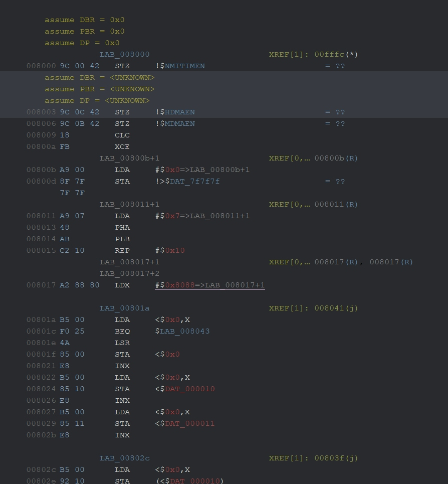

For this guide/reverse-along I’ve chosen Street Fighter II – The World Warrior. Mainly because I love SFII, it was one of my first SNES games, it is an early SNES title so should be fairly tame code wise. While it is the first 2MB game it also has a lot of graphics, music and samples. So the code should be quite small, with lots of data and scripting systems. Also SF2Platnium has done a nice job of explaining some of its mechanics. They also didn’t compress the graphics making it easier to deal with.

I’m using Ghidra 9.12 ( as I don’t see the reason to update and break my importers ) and for this I’m using aChan1989’s ghidra-65816 plugin https://github.com/achan1989/ghidra-65816

Things this guide is not:
- How to program a SNES; I expect you to know your registers and how the SNES works.
- How to program in 65816; likewise I expect you to know and understand 65816.
- How to program in Python; the scripting is present as is and I won’t discuss how to make or modify them.

# Getting Started

Make a new project.

Import the binary, in this case I’m using the “Street Fighter II - The World Warrior (E) [!].sfc” from GoodSNES, E as I’m from a PAL region.

Be sure to set the Format to “Raw Binary” and select the 65816 plugin as the language,65816:LE:default:default

In Options give it a dummy block name, won’t matter as we are going to remove it anyway.

Apply the processor defined labels and anchor them. 

Double click on the file to open the code browser, **don’t run** the Analyze command, say _no_.

We need to know what type of file it is, LO ROM or HI ROM, Slow or Fast. Using Mesen-S open the sfc file and go to `Tools > Log Window` and you should see something similar to 
~~~~~~~~~~~~~~~~~~~~~~~~~~~~~
-----------------------------
File: Street Fighter II - The World Warrior (E) [!].sfc
Game: Street Fighter 2
Game code: n5
Type: LoROM
Map Mode: $20
Rom Type: $00
File size: 2048 KB
ROM size: 2048 KB
-----------------------------
~~~~~~~~~~~~~~~~~~~~~~~~~~~~~
So from this we can see we are LoROM and type $20 says we are SLOW ROM. Also we are 2MB

First we need to remove the dummy map we added when adding the file. So go `Window > Memory Map` then select the only entry click the `red X` in the menu bar. Say yes when asked. 

Then go the Ghidras Script panel and edit in simple editor my “addLoROMFastMemoryMap.py”

I actually have a Fast and Slow section use # to comment out the one you don’t need. So in this case I want slow so I will comment out the For Fast section. 

We also need to update the number of banks, to get the number take 2048 (From above) and divide by 32 so for 2MB we have 64 banks, you could also just put the maths into python. So edit the `range(0,16)` change the 16 or whatever the number is for you when you open this file, to the number of banks you need, this case is 64. Save the script and run it with the green play button.

Now we have the SNES memory map with WRAM, PPU1,2 CPU 1 and 2 registers, DMA registers and then all your banks. 

Also at this point also run the script “AddSnesLabels.py” this gives you all the registers with FULLSNES names.

Before we can use any of the other scripts we have to manually make each type, for some reason I can only find “types used in this project” and not “builtin ones” .. so go to 008000 or 808000 if you are in a fast. Press T ,type `byte` in the box and press return. Then press `c` to clear it. Do it again only type `word`,clear, `pointer16`, clear, `pointer24`, clear, `char`, clear and finally `int3`, clear.

Now we need to set the SNES header and find our start vectors. For this we use the script "AddSNESHeader.py" if you are in a FAST ROM case you will need to modify the addresses to be 0x80XXXX as you won’t have a 00 bank. Maybe I should just make a second script...

This will add the data types for the header. Now if you have SRAM you should see it and now is a great time to add it to the memory map for the particular amount and mapping your game needs. SFII doesn’t have any. 
The Vectors are now `dw` which is because not all of them will be valid, so look for ones that are actual addresses and press C on them to clear the DW, then T, pointer16. You can then use Y to add the rest. 
For this game *VEC_NMI_NATIVE*, *VEC_IRQ_NATIVE* and *VEC_RESET_EMULATION* look solid to me, so I set them. 
We will start at *RESET* vector, this is $8000 on mine. So go to 8000, either double click the pointer you just made or use G. 

Before we can start we need to set up the processor state at $8000. So with the line selected, press Ctrl+R
From the drop down select *ctx_EF(1)* and then in value type 1 and then click ok
Repeat the process for *ctx_MF(1)* and *ctx_XF(1)*. For *DBR(8)* set it to 0, likewise for *DP(16)* and *PBR(8)*.

Now the CPU is set to RESET conditions and we can start the disassembly. So press D. And then the code should start to appear. But it has issues, something like this.

Note I have the dark skin hack installed.

So labels are wrong, the references are on things that are immediate and not things that actually modify ram. I have no idea how to fix this in the actual plug-in(if you do please do tell), so I just made scripts. Which is handy as the SNES is kooky and needs the script anyway. 

Select from $8000 to $8085 and run 65816CleanUp.py 

Much better, but still there are errors. So note the 
~~~
     008011 A9 07       LDA     #$0x7
     008013 48          PHA
                    DATA BANK CHANGE
     008014 AB          PLB
~~~
We need to change the data bank. So select from the `PLB` to the end of the function at 008085 and then Ctrl+R, and change the `DBR` to 7, now Clear it with C, and then D to dissemble again. Then Run 65816CleanUp.py on it. I suggest you map this to a key combo, you will need it a lot. 

Then we still have some more fix up to do.
See the following code.
~~~
     008017 A2 88 80    LDX     #$0x8088
                    LAB_00801a                        XREF[1]: 008041(j)  
     00801a B5 00       LDA     <$0x0,X=>DAT_7e0000               = ??
     00801c F0 25       BEQ     $LAB_008043
     00801e 4A          LSR
     00801f 85 00       STA     <$0x0=>DAT_7e0000                 = ??
     008021 E8          INX
     008022 B5 00       LDA     <$0x0,X=>DAT_7e0000               = ??
     008024 85 10       STA     <$offset DAT_7e0010               = ??
     008026 E8          INX
     008027 B5 00       LDA     <$0x0,X=>DAT_7e0000               = ??
     008029 85 11       STA     <$offset DAT_7e0011               = ??
     00802b E8          INX
~~~
So the X is actually 8088, for some reason, then we load $00,X which is currently linked to 7e0000 which is not true. As its really pointing to 008088, so we need to patch up the reference. To do this click on the $0x0 part and press R. Double click the entry and the edit dialog comes up. No modify the address to be 8088. Then the next one at 8022, but we have an INX so the address is 8089. Then 8027 points to 808a. This loops a few times so these are not the only addresses it will access. But I don’t know what they are yet to really judge. 

A handy thing about my clean up script is it will set the A/XY sizes at the dest when it finds a JSR/JSL/JMP command. Well only direct ones it can’t handle jump tables sadly. This means when you disassemble a function that has been found, it should have the right size settings. Let’s look at the 80f0 function. So go to it, D assemble and clean up. Now going through 1 by 1 is tedious, this is why I have Auto65816Fixup.py when it finds a jump or jsr it will push it onto a list and then auto dissemble it. This is great to do once, but after the initial you want to do spot fixes with the normal version, as the code tends to call itself back a lot eventually causing it to take a while.

Drat straight into a jump table function in RAM, let’s fix the references so it’s 7e0032. Now we can go to it and see what writes to it. Nothing really so far. Lets pedal back and see what else we can find.

So there is a function at 819b. Lets clear the addr and auto fix.. 

Not a very big function, but it writes to 32, or at least can write to it, depending upon X.
~~~
     00806e A2 00       LDX     #$0x0
     008070 A9 84 85    LDA     #$0x8584
     008073 20 9B 81    JSR     !$SUB_00819b
~~~
So it’s called with X = 0 and sets the address at 32 to 8584. So we can add a reference to the 8584 value with R, need to click the + button this time, add the reference, the address should already be correct. But the Ref Type should be `COMPUTED_JUMP`

Before I go hopping off to it though there is another jsr call under it and some odd looking code.
~~~
     008076 20 6C 8D    JSR     !$SUB_008d6c
     008079 A9 80 85    LDA     #$0x8580
     00807c B1 A9       LDA     (<$offset DAT_7e00a9),Y           = ??
     00807e B1 85       LDA     (<$offset DAT_7e0085),Y           = ??
     008080 BF 8D 00 42 LDA     !>$0x42008d,X=>DAT_02858d         = 0Ah
     008084 58          CLI
     008085 4C F0 80    JMP     !$LAB_0080f0
~~~
That looks wrong. Note the A9 80 85, well 85 just so happens to be STA doesn’t it. Seems to be that the JSR at 8d6c changes A back to 8 bits. So let’s clear the code till 8085, then Ctrl+R on 8079 and set ctx_MF(1) to 1. D, then run the 65816 clean up on it, and we get
~~~
     008079 A9 80       LDA     #$0x80
     00807b 85 B1       STA     <$offset DAT_7e00b1               = ??
     00807d A9 B1       LDA     #$0xb1
     00807f 85 BF       STA     <$offset DAT_7e00bf               = ??
     008081 8D 00 42    STA     !$offset DAT_074200
     008084 58          CLI
     008085 4C F0 80    JMP     !$LAB_0080f0
~~~
Much better.

Now let’s look at the 8d6c function.
~~~
                    ********************************************
                    *                SUBROUTINE                *
                    ********************************************
                    SUB_008d6c                        XREF[1]: 008076(c)  
     008d6c C2 20       REP     #$0x20                             A16 
     008d6e 64 B2       STZ     <$offset DAT_7e00b2               = ??
     008d70 64 B4       STZ     <$offset DAT_7e00b4               = ??
     008d72 64 B6       STZ     <$offset DAT_7e00b6               = ??
     008d74 64 B8       STZ     <$offset DAT_7e00b8               = ??
     008d76 64 BA       STZ     <$offset DAT_7e00ba               = ??
     008d78 64 BC       STZ     <$offset DAT_7e00bc               = ??
     008d7a E2 30       SEP     #$0x30                             A8  XY8 
     008d7c A9 09       LDA     #$0x9
     008d7e 8D 05 21    STA     !$BGMODE                          = ??
     008d81 A9 39       LDA     #$0x39
     008d83 8D 07 21    STA     !$BG1SC                           = ??
     008d86 A9 41       LDA     #$0x41
     008d88 8D 08 21    STA     !$BG2SC                           = ??
     008d8b A9 49       LDA     #$0x49
     008d8d 8D 09 21    STA     !$BG3SC                           = ??
     008d90 A9 00       LDA     #$0x0
     008d92 8D 0B 21    STA     !$BG12NBA                         = ??
     008d95 A9 55       LDA     #$0x55
     008d97 8D 0C 21    STA     !$BG34NBA                         = ??
     008d9a 60          RTS
~~~
Yep it does set A to be 8bit, and we set up some registers. So let’s comment, a fast way to look this up is put break point in the function then use the register viewer in Mesen. 
~~~
     008d7c A9 09       LDA     #$0x9                             Mode 1, BG3 hi priority
     008d7e 8D 05 21    STA     !$BGMODE                          = ??
     008d81 A9 39       LDA     #$0x39                            BG1 $3800 64x32
     008d83 8D 07 21    STA     !$BG1SC                           = ??
     008d86 A9 41       LDA     #$0x41                            BG2 $4000 64x32
     008d88 8D 08 21    STA     !$BG2SC                           = ??
     008d8b A9 49       LDA     #$0x49                            BG3 $4800 64x32
     008d8d 8D 09 21    STA     !$BG3SC                           = ??
     008d90 A9 00       LDA     #$0x0                             BG1 tiles at $0000
     008d92 8D 0B 21    STA     !$BG12NBA                         = ??
     008d95 A9 55       LDA     #$0x55                            BG34 tiles at $5000
     008d97 8D 0C 21    STA     !$BG34NBA                         = ??
~~~
So this sets up BG1-3 and some tiles. Not sure what the true purpose of this mode is so I want label it yet. However vertical scrolling only happens in one place in this game right? The intro, you know the one, two guys duking it out on the streets then is scrolls up the tower Turtles style… only that isn’t in the SNES game, so not sure why we set up vertical mode ever. 
Anyway let’s get back to that 8584 function.
~~~
                    LAB_008584+1                      XREF[1,  008070(j), 008584(R), 
                    LAB_008584+2                               008584(R)  
                    LAB_008584
     008584 A0 00 20    LDY     #$0x2000=>LAB_008584+1
     008587 AF 8F A2 00 LDA     !>$DAT_00a28f                     = 60h
     00858b 20 1C 90    JSR     !$0x901c
                    LAB_00858e+1                      XREF[0,  00858e(R), 00858e(R)  
                    LAB_00858e+2
     00858e A0 00 22    LDY     #$0x2200=>LAB_00858e+1
     008591 35 82       AND     <$0x82,X
     008593 02 A9       COP     $offset VEC_COP_NATIVE            = FFE0h
~~~
Seems the XY index size is wrong.. something tells me capcom are happy to change it in functions and roll with it a lot… sigh.. This also means the Auto65816 is not going to be very useful for me on this project. It’s also worth noting we are still in DB 7. Not sure if the entire games mostly runs with DB 7 kinda makes me apprehensive that the first 6 banks are code…
~~~
assume DBR = 0x7
                    LAB_008584                        XREF[1]: 008070(j)  
     008584 A0 00       LDY     #$0x0
     008586 20 AF 8F    JSR     !$SUB_008faf
     008589 A2 00       LDX     #$0x0
     00858b 20 1C 90    JSR     !$SUB_00901c
     00858e A0 00       LDY     #$0x0
     008590 22 35 82 02 JSL     !>$SUB_028235
     008594 A9 17 85    LDA     #$0x8517
     008597 BE A9 0F    LDX     !$offset DAT_7e0fa9,Y             = ??
     00859a 85 B1       STA     <$offset DAT_7e00b1               = ??
     00859c A9 04 20    LDA     #$0x2004
     00859f 50 8E       BVC     $LAB_00852f
     0085a1 20 DB 8E    JSR     !$SUB_008edb
     0085a4 AF 7F 7F 7F LDA     !>$DAT_7f7f7f                     = ??
     0085a8 D0 1F       BNE     $LAB_0085c9
     0085aa 20 2A 8B    JSR     !$SUB_008b2a
     0085ad A9 01 8F    LDA     #$0x8f01
     0085b0 7F 7F 7F A0 ADC     !>$DAT_a07f7f,X
     0085b4 F9 20 2A    SBC     !$offset DAT_072a20,Y
     0085b7 8B          PHB
     0085b8 A9 02 A0    LDA     #$0xa002
     0085bb F9 20 2A    SBC     !$offset DAT_072a20,Y
     0085be 8B          PHB
     0085bf A9 FF 8F    LDA     #$0x8fff
     0085c2 7C 7F 7F    JMP     (!$LAB_007f7f,X)
~~~
Much better, only that `LDA 7F7F7F` looks fishy, and so does all the code after it, well it looks kind of ok but also not really, the a0f7f7 seems very wrong, I sense another function changes the size again. A is back to 8bits and, looking good
~~~
     0085a4 AF 7F 7F 7F LDA     !>$DAT_7f7f7f                     = ??
     0085a8 D0 1F       BNE     $LAB_0085c9
     0085aa 20 2A 8B    JSR     !$SUB_008b2a
     0085ad A9 01       LDA     #$0x1
     0085af 8F 7F 7F 7F STA     !>$DAT_7f7f7f                     = ??
     0085b3 A0 F9       LDY     #$0xf9
     0085b5 20 2A 8B    JSR     !$SUB_008b2a
     0085b8 A9 02       LDA     #$0x2
     0085ba A0 F9       LDY     #$0xf9
     0085bc 20 2A 8B    JSR     !$SUB_008b2a
     0085bf A9 FF       LDA     #$0xff
     0085c1 8F 7C 7F 7F STA     !>$DAT_7f7f7c                     = ??
~~~
The function continues for some time and after a few register size adjusts and remembering to keep setting the `DBR` register to 7, although I half expect some of the function calls to magically change it on me at some point. I get to the end of the function.
~~~
                    LAB_008614                        XREF[1]: 008624(j)  
     008614 BF C0 FF 00 LDA     !>$s_Street_Fighter_2_00ffc0,X    = "Street Fighter 2   
     008618 DF 00 7F 7F CMP     !>$DAT_7f7f00,X                   = ??
     00861c 9F 00 7F 7F STA     !>$DAT_7f7f00,X                   = ??
     008620 F0 01       BEQ     $LAB_008623
     008622 C8          INY
~~~
It reads the ROM name and compares it in memory, perhaps a reset detecting system?
Need to fix up a few references
~~~
     0086cb A9 BF       LDA     #$0xbf
     0086cd 8D 31 21    STA     !$offset DAT_072131
     0086d0 A0 FF       LDY     #$0xff
~~~
While 072131 is correct, ghidra doesn’t do mapping, so best remove the 07 to get the register. I might update the script to handle this better.

While looking over it again I spied this
~~~
     008594 A9 17 85    LDA     #$0x8517
     008597 BE A9 0F    LDX     !$offset DAT_7e0fa9,Y             = ??
     00859a 85 B1       STA     <$offset DAT_7e00b1               = ??
     00859c A9 04 20    LDA     #$0x2004
     00859f 50 8E       BVC     $LAB_00852f
     0085a1 20 DB 8E    JSR     !$SUB_008edb
     0085a4 AF 7F 7F 7F LDA     !>$DAT_7f7f7f                     = ??
     0085a8 D0 1F       BNE     $LAB_0085c9
     0085aa 20 2A 8B    JSR     !$SUB_008b2a
~~~
The 8517 was calling out to me a “pointer” however on closer inspection it’s wrong, the A is the wrong size. Time to fix. 

I’m going to now go and dig into the sub routines.

