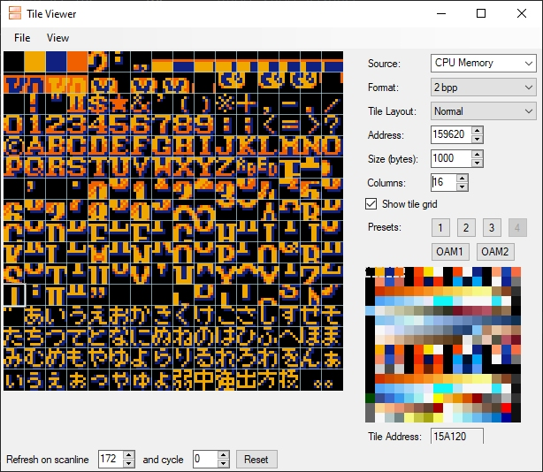

## Part 2

While digging through the subroutines in the last adventure, I came across this function. This is the kind of thing one looks for. 
~~~
                    ********************************************
                    *                SUBROUTINE                *
                    ********************************************
         assume DBR = <UNKNOWN>
                    SUB_008faf                        XREF[1]: 008586(c)  
     008faf AD C0 00    LDA     !$offset DAT_7e00c0               = ??
                    LAB_008fb2                        XREF[1]: 008fb2(j)  
     008fb2 D0 FE       BNE     $LAB_008fb2
     008fb4 B9 4C B3    LDA     !$DAT_07b34c,Y                    = F0h
     008fb7 85 10       STA     <$offset DAT_7e0010               = ??
     008fb9 B9 4D B3    LDA     !$DAT_07b34d,Y                    = 0Eh
     008fbc 85 11       STA     <$offset DAT_7e0011               = ??
     008fbe A9 80       LDA     #$0x80                            disable screen
     008fc0 8D 15 21    STA     !$VMAIN                           = ??
     008fc3 A9 01       LDA     #$0x1
     008fc5 8D 00 43    STA     !$DMAP0                           = ??
     008fc8 A9 18       LDA     #$0x18                            VRAM port 
     008fca 8D 01 43    STA     !$BBAD0                           = ??
     008fcd A0 00       LDY     #$0x0
                    _notBankOver                      XREF[2]: 008ff6(j), 009017(j)  
     008fcf C2 21       REP     #$0x21                             A16 C
     008fd1 B1 10       LDA     (<$offset DAT_7e0010),Y           = ??
     008fd3 89 01 00    BIT     #$0x1
     008fd6 D0 41       BNE     $_exit
     008fd8 20 80 8F    JSR     !$readDMAParamAndClipToBank
     008fdb A5 00       LDA     <$0x0=>DAT_7e0000                 ROM Source
     008fdd 8D 05 43    STA     !$DAS0L                           = ??
     008fe0 A5 14       LDA     <$offset DAT_7e0014               VRAM Dest
     008fe2 8D 16 21    STA     !$VMADDL                          = ??
     008fe5 A5 18       LDA     <$offset DAT_7e0018               Length
     008fe7 8D 02 43    STA     !$A1T0L                           = ??
     008fea E2 20       SEP     #$0x20                             A8 
     008fec A5 1A       LDA     <$offset DAT_7e001a               Bank
     008fee 8D 04 43    STA     !$A1B0                            = ??
     008ff1 A9 01       LDA     #$0x1                             fire DMA
     008ff3 8D 0B 42    STA     !$MDMAEN                          = ??
     008ff6 90 D7       BCC     $_notBankOver
     008ff8 C2 21       REP     #$0x21                             A16 C
     008ffa A5 02       LDA     <$offset DAT_7e0002               overflow length
     008ffc 8D 05 43    STA     !$DAS0L                           = ??
     008fff A5 1C       LDA     <$offset DAT_7e001c               VRAM overflow
     009001 8D 16 21    STA     !$VMADDL                          = ??
     009004 A9 00 80    LDA     #$0x8000                          start of bank
     009007 8D 02 43    STA     !$A1T0L                           = ??
     00900a E2 20       SEP     #$0x20                             A8 
     00900c A5 1A       LDA     <$offset DAT_7e001a               = ??
     00900e 1A          INC
     00900f 8D 04 43    STA     !$A1B0                            next bank
     009012 A9 01       LDA     #$0x1
     009014 8D 0B 42    STA     !$MDMAEN                          fire DMA
     009017 80 B6       BRA     $_notBankOver
                    _exit                             XREF[1]: 008fd6(j)  
     009019 E2 30       SEP     #$0x30                             A8  XY8 
     00901b 60          RTS
~~~
The main VRAM DMA system, huge part of any game and will give me some very tell tail data points of what the code does when putting a break point into it. I.e hit it. Let it exit see what appeared in VRAM and you know have a pretty good idea of which part of the game the code that called this is from.

Fairly standard stuff, but it brings us to the topic of WORD tables and data tables.

The readDMAParam function basically reads 2 more words and a byte, from the word we read, that gives us
~~~
Word ; src = odd means exit
Word VRAM Dest
Long Source
~~~
~~~
     008fb4 B9 4C B3    LDA     !$DAT_07b34c,Y                    = F0h
     008fb7 85 10       STA     <$offset DAT_7e0010               = ??
     008fb9 B9 4D B3    LDA     !$DAT_07b34d,Y                    = 0Eh
     008fbc 85 11       STA     <$offset DAT_7e0011               = ??
Gives us a source table for these above structs
                    DAT_07b34c                        XREF[1]: 008fb4(R)  
     07b34c AC          ??      ACh
                    DAT_07b34d                        XREF[1]: 008fb9(R)  
     07b34d B3          ??      B3h
     07b34e C2          ??      C2h
     07b34f B3          ??      B3h
     07b350 D1          ??      D1h
     07b351 B3          ??      B3h
     07b352 E0          ??      E0h
     07b353 B3          ??      B3h
     07b354 8E          ??      8Eh
~~~
First step is to make “words” while the table make sense. Normally they go up in RAM and have a sensible address, making them easily to follow. Not always just mostly. When one is lucky the first item points to data right after the table to give you an easy to find length.  Note above how it is XXB3 XXB3 XXB3 XXB3 good stuff. Also its AC CS D1 E0 etc this gives me high hopes that B3AC which is after the table of B34C is the end.
~~~
     07b3a7 B3          ??      B3h
     07b3a8 45          ??      45h    E
     07b3a9 B6          ??      B6h
     07b3aa 45          ??      45h    E
     07b3ab B6          ??      B6h
     07b3ac 00          ??      00h
     07b3ad 0C          ??      0Ch
     07b3ae 00          ??      00h
     07b3af 50          ??      50h    P
~~~
Right on the money!

Now these words are nice but I want labels on them. Luckily I have a script for that too. The “AddIndirectionRefToWordTable.py”

Before start, though we have to update the script
~~~
#createMemoryReference(data, dest, RefType.INDIRECTION)
createMemoryReference(data, dest, RefType.DATA_IND)
~~~
for Code tables you want the first one, for data tables, such as this the 2nd one.

Once selected, select all the words you want and run the script. 
~~~
                    WORD_07b34c+1                     XREF[1,  008fb4(R), 008fb9(R)  
                    WORD_07b34c
     07b34c AC B3       dw      DAT_07b3ac
     07b34e C2 B3       dw      DAT_07b3c2                        -> LAB_008000
     07b350 D1 B3       dw      DAT_07b3d1
     07b352 E0 B3       dw      DAT_07b3e0
     07b354 8E B5       dw      DAT_07b58e
     07b356 E8 B3       dw      DAT_07b3e8
~~~
The LAB_008000 is pesky, Ghidra loves to think anything with a label is code if it gets half the chance or a pointer if it looks good. But once we put the data in order we will see it goes away. 
Let’s look at one.
~~~
                    DAT_07b3ac                        XREF[1]: 07b34c(R)  
     07b3ac 00          ??      00h
     07b3ad 0C          ??      0Ch
     07b3ae 00          ??      00h
     07b3af 50          ??      50h    P
     07b3b0 20          ??      20h     
     07b3b1 96          ??      96h
     07b3b2 15          ??      15h
     07b3b3 00          ??      00h
     07b3b4 08          ??      08h
     07b3b5 00          ??      00h
     07b3b6 58          ??      58h    X
     07b3b7 20          ??      20h     
     07b3b8 AA          ??      AAh
     07b3b9 15          ??      15h
     07b3ba 80          ??      80h
     07b3bb 04          ??      04h
     07b3bc 00          ??      00h
     07b3bd 10          ??      10h
     07b3be A0          ??      A0h
     07b3bf 91          ??      91h
     07b3c0 15          ??      15h
     07b3c1 FF          ??      FFh
~~~
This nicely matches the pattern we extracted from the code, Word, Word, Long, Word, Word, Long, Word, Word, Long and then FF to terminate

We could do this manually or we could make a struct

In the Data Type Manager right click on the ROM name and then New > Structure. Lets name this sDMA_VRAM
Double click in the empty DataType field, and type word + press return or use the ... to select it

Then in the new empty row, do it again

Then in the new empty row, type pointer24

Then fill in the names.

And Save. Close the window. Now select the first entry in the ROM, so 07b3ac and press T, type/select sDMA_VRAM and you should see

Sadly Ghidra has not made a reference for us.

But let’s first just put them all in.

You can select multiple bytes and press Y to make multiple copies, you can’t just do the lot as the last byte of each section is not in the struct

I also then like to go back and set all the FF’s to bytes, so when using the skip to next undefined they will be skipped. 

Actually it did make references, just not on the first one for some reason. So I cleared it and made it a struct again, sorted it. 

Now what do these numbers mean. Well if we open up Mesen-S’s Tile Viewer and set the source to CPU Memory, then we can set the Address to be the pointer24 value and the size to be the length, roughly and have a look. This is what the first entry shows.

 
Now that I know what this data is, it would be nice to name it and then make it a byte array. Makes is small as we scroll by and tell me latter “this is already known”. Doing this manually would be pain, luckily I have a script, and it’s called “ByteArrrayToNextLabel.py” which mostly works. Not always don’t have all the labels yet, but most of the time it does the right thing (incidentally the first entry in the table above is one of the cases where it doesn’t), for those cases there is “ByteArrayofSize.py”. One other caveat is Ghidra sometimes just starts to decode data in the middle of nowhere because some wrong label at once point referenced it, which will cause the script to halt and fail. Just something to be aware of in your travels.

After hours of looking, guessing, sometimes you can see plain as day other times you need the right pallete tm, I have a good stab at most items in the list. Getting only one of the sub Structs in the list lets me have a pretty good guess what the the list does.

As I get find more function calls to this function, I will be able to make a Enum that holds what the values are and then put that into the code to make it easier to work out what a function is part of.
